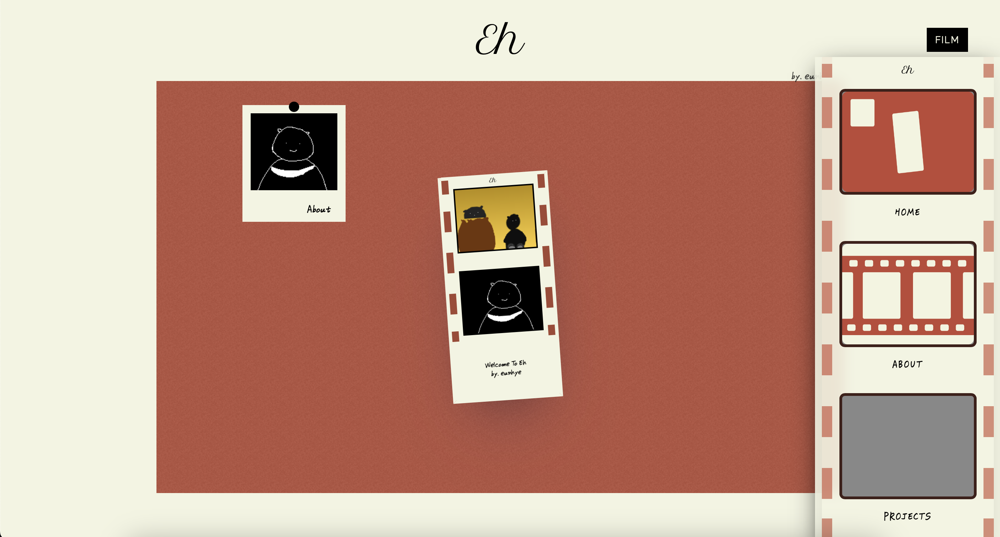

# 포트폴리오 사이트 프로젝트

- [프로젝트 소개](#프로젝트-소개)
- [사용언어, 툴](#사용-언어-툴)
- [페이지 구성](#페이지-구성)
- [진행 상황](#진행-상황)
  - [프리뷰](#프리뷰)  
  - [디자인](#디자인)  
  - [기능](#기능)  

 
 

## 프로젝트 소개

react를 복습하는 목적으로 만든 프로젝트
**나를 나타낼 수 있는 사이트**

 
 

## 사용 언어, 툴

- JavaScript(jsx)
- React, react-router-dom(v.6)
- scss
- ide) Visual Studio Code

 
 

## 페이지 구성

- Home Page: 사이트의 메인 페이지 (각 컴포넌트의 내용을 한눈에 볼 수 있게 요약한 페이지)
- Projects Page: 개발 공부를 하면서 만든 토이 프로젝트들의 사진, 링크, 설명, 코드가 있는 페이지
- About Page: 간단한 자기소개, 활용가능한 언어들의 숙련도를 볼 수 있는 페이지
- Contact Page: 연락, 피드백등을 직접적으로 받기 위한 페이지 (이메일)

 
 

## 진행 상황

### 프리뷰

### 디자인

- 레이아웃: Navbar(90%), Component 공통 페이지(5%)
<!-- - css 이펙트: -->

### 기능

- 각 컴포넌트의 url연결 (메뉴 클릭 시 해당 컴포넌트 페이지로 이동)
