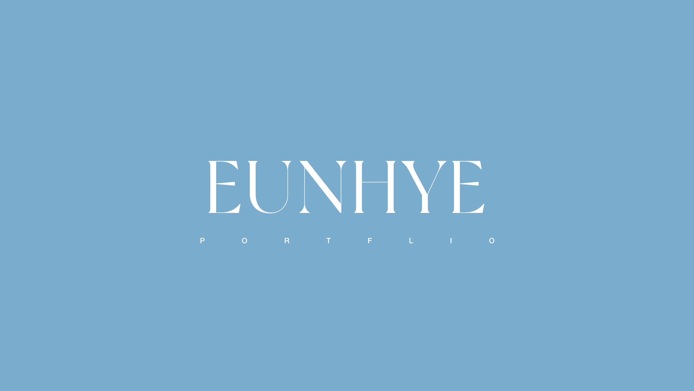
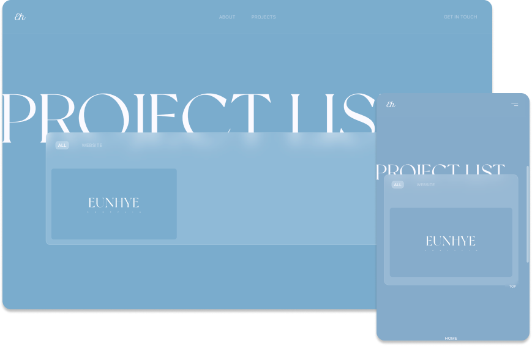
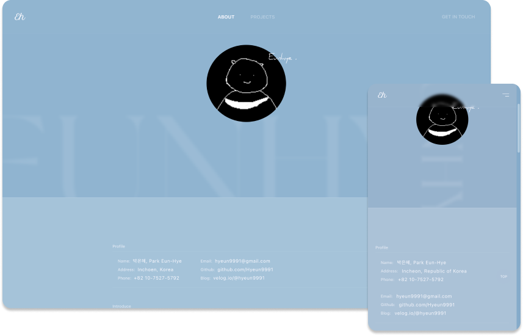
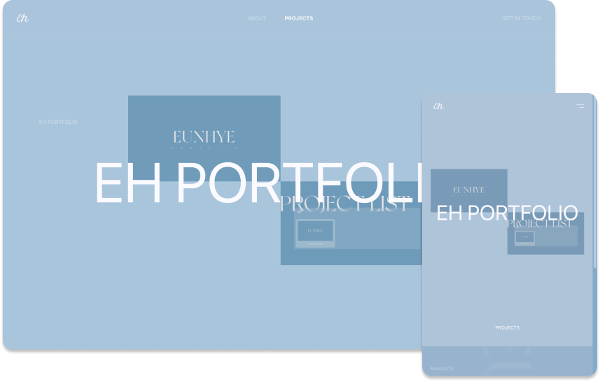
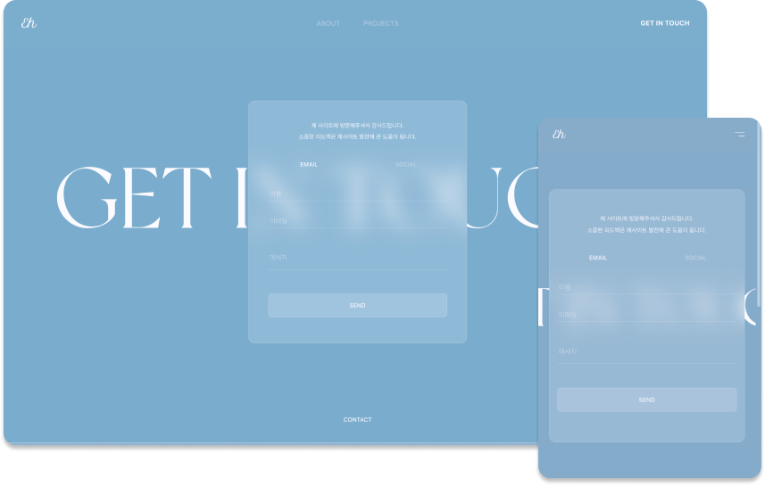

## Eh: Eunhye Portfolio



#### 목차

- [스크린샷](#스크린샷)
- [프로잭트 소개](#프로젝트-소개)
  - [개발 기간](#개발-기간)
  - [개요 및 기획 의도](#개요-및-기획-의도)
  - [기술 스택](#기술-스택)
  - [기여한 일](#기여한-일)
- [프로잭트 구성](#프로젝트-구성)
  - [폴더](#src폴더)
  - [페이지](#페이지)
- [기능 구현](#기능-구현)
  - [Layout](#layout-component)
  - [Header](#header-component)
  - [scrollToTop](#scrolltotop-component)
  - [ToTopButton](#totopbutton-component)
  - [EmailForm](#email-form)
- [개발 후기](#개발-후기)
  - [추후 개선점](#추후-개선점)

<br>
<br>

# 스크린샷






<br>
<br>
<br>

# 프로젝트 소개

## 개발 기간

_2022.11 ~ 현재_

<br />

## 개요 및 기획 의도

- React로 개발한 홈페이지, 포트폴리오 웹사이트
- 웹 개발에 입문하고 습득한 지식을 기반으로 사이트 기획, 기능 구현, 배포 과정을 학습할 목적으로 만든 프로젝트

<br>

## 기술 스택

- HTML
- SCSS(v.1.56.1)
- JavaScript(ES6+)
- React(v.18.2.0), react-router-dom(v.6.4.3), CRA
  - 편한 유지보수, 넓은 생태계로 선택

<br>

## 기여한 일

- Figma를 활용해 사이트의 전반적인 구성과 디자인을 기획
- 파일 구성을 기획
- EmailJS를 활용해 이메일폼 구현
- 컴포넌트 단위로 페이지를 만들고 React Router를 활용해 URL 이동 기능 구현
- `useLocation`, `useEffect` 를 활용하여 URL이 변경될 때마다 스크롤 위치를 맨 위로 올리는 기능 구현
- window에 `scrollTo` 함수를 활용하여 클릭하면 스크롤 위치를 맨 위로 올리는 기능 구현
- window의 높이를 구해 일정 스크롤 위치를 초과하면 화면에 나타나는 기능 구현
- `@media-query` 를 활용해서 반응형 적용

<br>
<br>
<br>

# 프로젝트 구성

## src/폴더

| 폴더       | 구성                                               | 설명                                                                             |
| ---------- | -------------------------------------------------- | -------------------------------------------------------------------------------- |
| assets     | fonts, images                                      | 폰트와 이미지를 보관하는 폴더                                                    |
| components | Layout(Header, Footer), ScrollToTop, ToTopButton   | 사이트 전역에서 사용할 컴포넌트 폴더                                             |
| pages      | Homepage.js, AboutPage.js, Projects.js, Contact.js | Containers 컴포넌트를 감싸는 컴포넌트 폴더, Layout 컴포넌트 안에 들어갈 컴포넌트 |
| containers | Home, About, Projects, Contact                     | pages 컴포넌트 안에 들어갈 컴포넌트 폴더                                         |
| styles     | \_variable.scss                                    | 프로젝트 전역에서 사용할 스타일 변수 모음 폴더                                   |

<br />

## 페이지

| 페이지   | 구성                                  | Path        |
| -------- | ------------------------------------- | ----------- |
| Home     | 프로젝트 커버, 프로젝트 리스트 페이지 | `/`         |
| About    | resume 페이지                         | `/about`    |
| Projects | 프로젝트 리스트 페이지                | `/projects` |
| Portfolio | 프로젝트 리스트 중 Portfolio 페이지                | `/projects/portfolio` |
| Contact  | 이메일을 보낼 수 있는 페이지          | `/contact`  |

<br>
<br>
<br>

# 기능 구현

## Layout Component

```jsx
import React from 'react';
import './Layout.scss';
import Header from './Header/Header';
import Footer from './Footer/Footer';

const Layout = (props) => {
  return (
    <div className="layout">
      <Header />
      <main className="main">{props.children}</main>
      <Footer />
    </div>
  );
};

export default Layout;
```

**각각의 Container 컴포넌트를 감싸줄 컴포넌트**

`main` 태그안에 `{props.children}` 이 들어올 수 있도록 설계

<br />

## Header Component

```jsx
import React, { useState } from 'react';
import { Link, NavLink } from 'react-router-dom';
import './Header.scss';

const Header = () => {
  /**
   * 토글을 닫아두기 위해 초기값을 false로 설정
   */
  const [btnClick, setBtnClick] = useState(false);

  /**
   * state(false) true/false 토글 함수
   */
  const showMenu = () => {
    setBtnClick(!btnClick);
  };

  return (
    <header>
      <div className={`header-container ${btnClick ? 'open' : ''}`}>
        {/* main-header */}
        <div className="main-header">
          // 생략
          <div
            className={`open-menu-btn ${btnClick ? 'clicked' : ''}`}
            onClick={showMenu}
            type="button"
          >
            // 생략
          </div>
        </div>
        {/* /main-header */}
      </div>
    </header>
  );
};
```

```scss
.active-link {
  opacity: 0.2;

  &.active {
    opacity: 1;
    font-weight: 700;
  }
}
```

**`NavLink` 태그로 링크에 active 효과주기**

선택한 링크에 효과를 주기 위해 구글링을 참고한 결과 `NavLink` 의 존재를 알게되었습니다.
`.active` 클래스에 `opacity: 1` 스타일링을 줘서 선택한 메뉴를 구분가능하게 했습니다.

<br />

**`useState` 를 활용해 모달창 열기/닫기 기능**

해당 태그에 삼항연산자 `${btnClick ? 'open' : ''}` 를 활용하여 `true` 일 때 `open` 클래스가 붙도록 구현했습니다.

<br />

> **Reference**
>
> 깃허브 링크
> [https://github.com/Hyeun9991/toy-projects/tree/main/react-portfolio/src/components/Layout/Header](https://github.com/Hyeun9991/toy-projects/tree/main/react-portfolio/src/components/Layout/Header)
>
> 참고한 블로그 링크
> [https://velog.io/@seong-dodo/React-Link와-NavLink](https://velog.io/@seong-dodo/React-Link%EC%99%80-NavLink)

<br />

## ScrollToTop Component

```jsx
import React, { useEffect } from 'react';
import { useLocation } from 'react-router-dom';

const ScrollToTop = () => {
  const { pathname } = useLocation();

  /**
   * url변경 시 스크롤 위치를 맨 위로 옮기는 컴포넌트
   */
  useEffect(() => {
    window.scrollTo(0, 0);
  }, [pathname]);

  return null;
};

export default ScrollToTop;
```

```jsx
// index.js
import ScrollToTop from './components/ScrollToTop/ScrollToTop';

const root = ReactDOM.createRoot(document.getElementById('root'));
root.render(
  <BrowserRouter>
    <ScrollToTop />
    <App />
  </BrowserRouter>
);
```

**url 변경 시 자동으로 맨 위로 올라가는 컴포넌트**

`Link to` 로 페이지 이동시 스크롤의 위치가 그대로 있는 현상을 발견했습니다.
공식문서를 참고하여 `Scroll Restoration` 라고 부르는 기능을 구현하는데 성공했습니다.
`pathname` 을 인식할 수 있게 `BrowserRouter` 태그 안에 `ScrollToTop` 컴포넌트를 넣어줬습니다.

<br />

> **Reference**
>
> React Router 공식문서 링크
> [https://v5.reactrouter.com/web/guides/scroll-restoration](https://v5.reactrouter.com/web/guides/scroll-restoration)

<br />

## ToTopButton Component

```jsx
import React, { useState, useEffect } from 'react';
import './ToTopButton.scss';

const ToTopButton = () => {
  const [scrollY, setScrollY] = useState(0);
  const [scrollYActive, setScrollYActive] = useState(false);

  /**
   * 클릭 시 스크롤을 맨 위로 옮기는 함수, 부드럽게 전환
   */
  const scrollToTop = () => {
    window.scrollTo({
      top: 0,
      behavior: 'smooth',
    });
  };

  /**
   * 스크롤 값이 120을 넘으면 scrollYActive state를 true로 바꿔주는 함수
   */
  const toTopBtnEffect = () => {
    if (scrollY > 120) {
      setScrollY(window.scrollY);
      setScrollYActive(true);
    } else {
      setScrollY(window.scrollY);
      setScrollYActive(false);
    }
  };

  useEffect(() => {
    const scrollEvent = () => {
      window.addEventListener('scroll', toTopBtnEffect);
    };
    scrollEvent();
    /**
     * window이벤트로 등록을 했기떄문에 이 컴포넌트가 unmount되도 스크롤 될때마다
     * toTopBtnEffect 함수가 계속 실행이 됨 -> 메모리 누수 발생
     * 그렇게 때문에 return 하고 이벤트 제거하는 코드 작성
     */
    return () => {
      window.removeEventListener('scroll', toTopBtnEffect);
    };
  });

  return (
    <button
      onClick={scrollToTop}
      className={`to-top-btn ${scrollYActive ? 'to-top-show' : ''}`}
    >
      top
    </button>
  );
};

export default ToTopButton;
```

**클릭 시 맨 위로 올라가는 컴포넌트**

스크롤이 길어지면서 맨 위로 올라가기 버겁다는 생각이 들었습니다.
공식문서를 참고하여 사용자 편의를 위해 한번에 맨 위로 올라갈 수 있는 기능을 구현했습니다.
`scrollTo()` 의 `options` 문법을 활용해서 기능을 구현했습니다.
(부드러운 효과를 주기 위해 `behavior: 'smooth'` 속성을 줬습니다.)

<br />

**스크롤 이벤트**

처음부터 나와있는게 아니라 스크롤을 하면 나올 수 있게 만들고 싶었습니다.
특정 스크롤 값을 초과하면 나타나고, 부드러운 애니메이션을 주기위해 구현했습니다.

<br />

> **Reference**
>
> 깃허브 링크
> [https://github.com/Hyeun9991/toy-projects/tree/main/react-portfolio/src/components/ToTopButton](https://github.com/Hyeun9991/toy-projects/tree/main/react-portfolio/src/components/ToTopButton)
>
> mdn 링크
> [https://developer.mozilla.org/en-US/docs/Web/API/Window/scroll](https://developer.mozilla.org/en-US/docs/Web/API/Window/scroll)

<br>

## Email Form

```js
import React, { useRef, useState } from 'react';
import emailjs from '@emailjs/browser';

const ContactContainer = () => {
  const form = useRef();

  const sendEmail = (e) => {
    e.preventDefault();

    emailjs
      .sendForm(
        'YOUR_SERVICE_ID',
        'YOUR_TEMPLATE_ID',
        form.current,
        'YOUR_PUBLIC_KEY'
      )
      .then(
        (result) => {
          console.log(result.text);
          form.current.reset(); // 전송 버튼 누르면 form 초기화
        },
        (error) => {
          console.log(error.text);
        }
      );
  };

  return (
    <form ref={form} onSubmit={sendEmail} className="email-form">
      <div className="label-input input-form">
        <label htmlFor="name"></label>
        <input type="text" id="name" name="user_name" placeholder="이름" />
      </div>
      <div className="label-input input-form">
        <label htmlFor="email"></label>
        <input type="email" id="email" name="user_email" placeholder="이메일" />
      </div>
      <div className="label-input">
        <label htmlFor="message"></label>
        <textarea name="message" id="message" placeholder="메세지" />
      </div>
      <div className="submit-btn">
        <input type="submit" value="Send" className="send-btn" />
      </div>
    </form>
  );
};
```

**a 태그의 mailto 속성**
`<a href="mailto:email@com />`

이메일 전송 버튼을 만들기 위해 a 태그의 mailto 속성을 이용해서 만들었지만 메일창이 뜨는 시간이 너무 오래걸려서 사용자로 하여금 불편함을 초래한다고 생각했습니다.

<br />

**Email 전송 Form을 구현하기 위해 EmailjS 사용**

완성도 있는 사이트는 모두 email form 기능이 있다고 생각했습니다. 블로그 포스팅과 공식 사이트를 참고해서 form 기능을 구현했습니다.

<br />

**form 초기화**

구현된 이메일 폼에 테스트를 하던 중 input창안에 value들이 사라지지 않고 그대로 남아있었습니다. 블로그 포스팅을 참고하여 React의 `useRef`로 form 태그를 선택해서 성공적으로 메일이 보내지는 동시에 초기화하는 코드를 작성했습니다.
테스트 결과 성공적으로 form이 초기화되면서 input창안에 value들이 초기화됐습니다.

<br />

> **Reference**
>
> 공식 문서 링크
> https://www.emailjs.com/docs/examples/reactjs/
>
> 참고 블로그 링크
> https://skm1104.tistory.com/61 >https://gahyun-web-diary.tistory.com/103

<br>
<br>
<br>

# 개발 후기

- 이론적으로 습득한 지식 이외 새로운 지식을 습득하는 시간이 되었습니다. 새롭게 알게된 지식은 공식 문서를 활용해 학습했습니다.
- 테스트하는 과정에서 불편했던 점을 발견하고 이를 보완할 수 있는 기능을 구현하면서 개발이 재밌게 느껴졌습니다.

<br />

## 추후 개선점

- 코드 리팩토링과 게시판을 작성하기 위한 CRUD를 학습해서 버전 2에 추가할 계획입니다.

<br />
<br />
<br />

🔝 [Back To Top](#eh-eunhye-portfolio)
